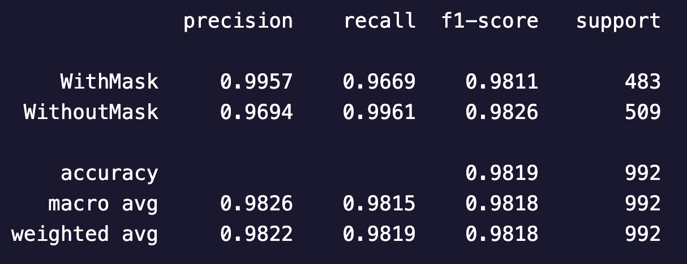

> **Embedded** **System** **Project** **(ESE5)**
>
> **By** **-** **Abhishek** **Rajora** **(B20CS002)** **and**
> **Vinayak** **Verma** **(B20EE079)**
>
> **Face** **Mask** **Detection**
>
> The problem of face mask detection in embedded systems involves
> detecting whether a person is wearing a mask or not, in real-time,
> with the help of cameras placed at various locations. The goal is to
> ensure that people follow safety protocols during pandemics like
> COVID-19 and prevent the spread of the disease.
>
> To come up with the possible solutions which can be implemented with
> Deep Learning, we present the most significant factors to do the same.
> Such includes
>
> 1\. **Transfer** **Learning:** The approach is to use transfer
> learning, which involves using the pre-trained model such as ResNet
> and fine-tuning it for our specific task. In this approach, the
> pre-trained model is used as a starting point, and the final layers
> are replaced with new layers to fit the new problem. Transfer learning
> can help in reducing the time and computational cost of training a
> model from scratch.
>
> 2\. **Data** **Augmentation:** Another key approach is to use data
> augmentation techniques to generate more training data from existing
> images. This can help in improving the accuracy of the model by
> providing more varied and diverse data to train on.
>
> 3\. **Real-time** **Detection:** Real-time detection is another
> important aspect of face mask detection in embedded systems. This
> requires optimizing the model for fast and efficient inference on
> embedded devices.
>
> **Deep** **Learning** **for** **face** **mask** **detection**
>
> Deep learning as the state-of-the-art models are used for face mask
> detection due to its ability to automatically learn features from the
> raw data and identify complex patterns in the images. This allows deep
> learning models to effectively distinguish between images of people
> with and without masks, even when faced with variations in lighting,
> facial expressions, and other factors that can make the task
> challenging. Additionally, deep

Embedded System Project (ESE5) 1

> learning models can be fine-tuned on large datasets, making them
> highly adaptable to different scenarios and allowing for high accuracy
> in face mask detection.
>
> We proceed with hyperparameter tuning for the deep learning
> architectures and utilize the pre-trained models and implement our own
> custom layer architecture to optimize the model for face mask
> detection.
>
> **Choices** **for** **Hyperparameter** **Tuning**
>
> The following hyperparameters will be used for the neural network
> implementations:
>
> optimizer - Adam: since it uses adaptive learning rates for each
> parameter therefore it converges quickly to a good solution and handle
> sparse gradients effectively
>
> activation - ReLU: This activation function is useful in this model
> because it introduces non-linearity to the network, allowing it to
> learn more complex features and patterns in the data.
>
> layers - 10 Dense layers and 9 Dropout layers
>
> Dense Layers: provide more non-linear mappings of the input data,
> which helps the network learn more complex relationships between the
> input and output as it allow for better detection of facial features
> and more accurate classification of masked vs. unmasked faces.
>
> Dropout Layers: Dropout layers were used to prevent overfitting by
> reducing the number of parameters
>
> loss - SparseCategoricalCrossentropy: suitable for multi-class
> classification problems with integer labels since here we care for
> prediction of both the classes (i.e. 0 and 1) and therefore evaluation
> metric used is SparseCategoricalAccuracy
>
> dropout rate - 0.2: It is a regularization technique that randomly
> drops out a percentage of the neurons in the layer during training,
> which helps prevent overfitting
>
> learning rate - 0.00001: The learning rate is kept low to avoid
> overshooting the model’s optimal weights
>
> The final Dense layer has a softmax activation function and output
> dimensionality equal to the number of classes (2 in this case:
> with_mask and without_mask)

Embedded System Project (ESE5) 2

> patience - 10: number of epochs to wait before stopping training if
> the validation loss has not improved
>
> These hyperparameters were selected based on best practices and
> experimentation to achieve good performance on the face mask detection
> task.
>
> **ResNet-18** **Implementation**
>
> The ResNet-18 model is a deep neural network architecture that is
> designed for image classification tasks. It uses a ResNet18 base model
> that has been pre-trained on **ImageNet**, which has shown to be
> effective in image classification tasks. The ResNet18 model is used to
> extract features from the input image.
>
> The model is trained using the Adam optimizer and the Sparse
> Categorical Crossentropy loss function. The model's performance is
> evaluated using Sparse Categorical Accuracy metrics.
>
> **ResNet-18** **+** **CNN(Dense** **Layers)** **Implementation**
> **(our** **improved** **architecture)**

Embedded System Project (ESE5) 3

> Using ResNet18 base as a backbone of detector architecture, several
> fully connected layers are added to learn a mapping from the extracted
> features to the classes. The fully connected layers consist of
> multiple hidden layers, each followed by a dropout layer to prevent
> overfitting. The final layer is a softmax layer that outputs the
> probability distribution over the classes.
>
> This architecture is a deep neural network architecture that is
> designed to improve accuracy in face mask detection or generally in
> classification over base ResNet-18
>
> **ResNet-50** **+** **CNN(Dense** **Layers)** **Implementation**
> **(our** **improved** **architecture)**

Embedded System Project (ESE5) 4

> This neural network design uses transfer learning with ResNet50 as the
> base model and applies CNN headers on top of it for face mask
> detection. The model has the following specifications:
>
> The base model is configured to exclude the top layer and use global
> average pooling to reduce the number of parameters in the model
>
> The implication of the model on the accuracy of face mask detection is
> that it can potentially achieve high accuracy due to the use of a
> pre-trained ResNet50 base model, which has been trained on a large
> dataset of diverse images.
>
> The addition of multiple Dense layers with dropout helps to fine-tune
> the model for the specific task of face mask detection, while the
> early stopping technique helps prevent overfitting. However, the
> actual accuracy of the model will depend on various factors such as
> the quality and quantity of the training data, hyperparameter tuning,
> and the specific implementation details.
>
> **Evaluation** **of** **Detection** **Models**
>
> **Train** **and** **Validation** **Loss** **Based** **on** **Models**
>
> ResNet-18
> Detector over ResNet- Detector over ResNet-50 18
>
> Based on the evaluation of the train and validation loss, it seems
> that ResNet18 performs worse compared to the other two models,
> ResNet18 with CNN and ResNet50 with CNN. This is due to the fact that
> ResNet has a simpler architecture and might not be able to capture
> complex patterns in the data as well as the other two models.

Embedded System Project (ESE5) 5

> Whereas ResNet18 with CNN performs better than the ResNet model in
> terms of loss, which could be attributed to the added CNN headers that
> allow for better feature extraction and representation.
>
> And ResNet50 with CNN performs the best in terms of loss, which is not
> surprising as ResNet50 is a deeper and more complex architecture than
> ResNet. The added CNN headers also provide additional feature
> extraction capabilities, resulting in better representation learning
> and ultimately better performance.
>
> **Based** **on** **number** **of** **Parameters** **or** **layers**
>
> 1 Dropout layer removed
>
> Removing a single dropout layer to increase the number of parameters,
> we can see that the validation curve is slightly above
>
> than train curve

All dropout layers are kept

The current parameters with no additional dropout layers and hence avoid
overfitting. Therefore it outputs a good validation curve which is
closer to train

curve

All dropout layers removed

By removing all dropout layers our the model is able to get more complex
features since the number of parameters reached to millions and
therefore the loss reaches zero in less

epochs

> The removal of all dropout layers from the model may result to overfit
> and requires a lot more time, the accuracy and losses presented may
> depend on data distribution and thus we proceed with keeping all the
> dropout layers to obtain the best results.
>
> **Accuracy**
>
> To evaluate the models' performance, sparse categorical accuracy,
> confusion matrix, and classification table could be used.

Embedded System Project (ESE5) 6

> Detector with ResNet-18 backbone Detector with ResNet-50 backbone
>
> **ResNet-18** **+** **CNN** **(our** **best** **model)**
>
> Confusion Matrix Classification Table
>
> Sparse categorical accuracy measures the proportion of correctly
> predicted class labels out of all predictions, and it is a common
> metric for multi-class classification tasks like face mask detection.
> A confusion matrix shows the number of correct and incorrect
> predictions for each class, and it could provide insights into the
> models' strengths and weaknesses in classifying different classes.
>
> Based on the above discussion, ResNet18 with CNN could potentially
> outperform ResNet18 and ResNet50 due to its enhanced representation
> power, while ResNet50 might suffer from overfitting and longer
> training time.

Embedded System Project (ESE5) 7

> **Results**
>
> Predicted Results of Detector based on CNN architecture build with a
> backbone over ResNet18
>
> The face mask detection model designed using ResNet18 with CNN
> architecture was able to successfully predict whether a person is
> wearing a mask or not. The model achieved high accuracy on both
> training and validation sets, with the best performance obtained using
> ResNet18 with CNN architecture, which outperformed ResNet18 and
> ResNet50 with CNN architectures in terms of loss and sparse
> categorical accuracy.
>
> A Flutter UI was developed to integrate the trained model with a
> mobile application, providing an easy-to-use interface for the
> end-users. The successful implementation of the face mask detection
> model using deep learning and the integration with a mobile
> application signifies the robustness and lightweight nature of the
> developed model.

Embedded System Project (ESE5) 8

Embedded System Project (ESE5) 9
