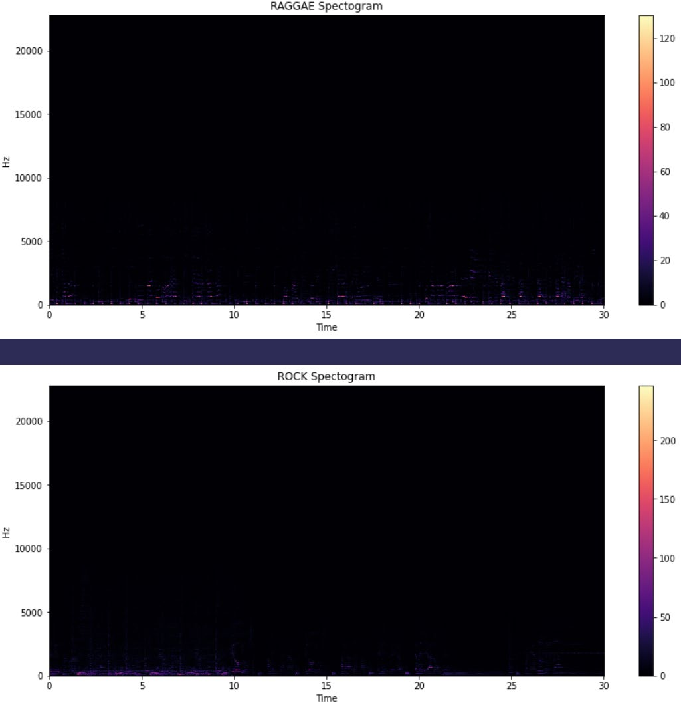
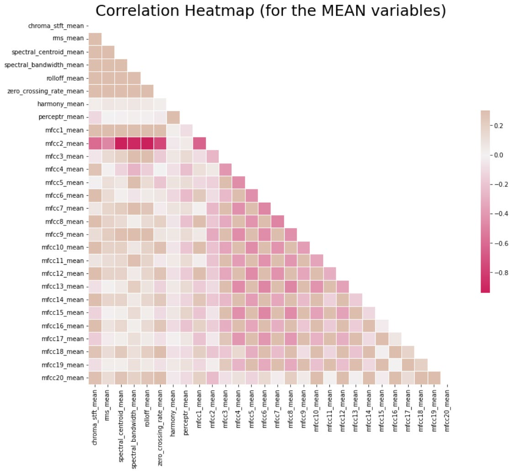
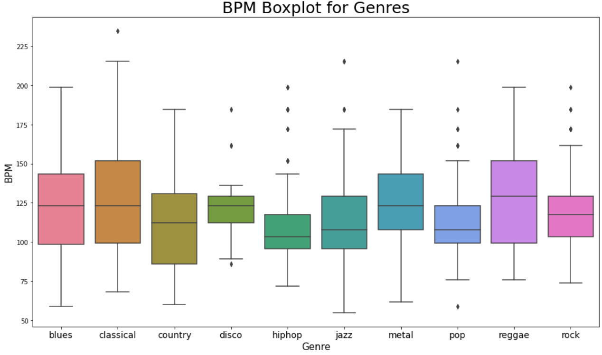

> **Music** **Genre** **Classification**
>
> Vinayak Verma, Kartik Choudhary
>
> B20EE079, B20CS025 f
>
> Pattern Recognition and Machine Learning
>
> CSL2050

CSL2050 2

> Abstract

This paper showcases our experience with building a Music Genre
Classifier. Our main aim was

to create a machine learning model to classify between different genres
of music.We used the

GTZAN Genre Collection dataset. We processed the dataset to be useful in
classification models.

We used multiple classification models using different algorithms and
compared their results.

CSL2050 3

> Music Genre Classification
>
> **INTRODUCTION**
>
> Music can be classified into multiple genres of music. The genre of
> music can be

identified by defining a generalized set of criteria with respect to
each genre of music. This

generalized criteria can be obtained by using certain features that an
audio file bears. Features

like tempo, beats, chroma values, spectral values.

**Dataset**

The GTZAN genre collection dataset was collected in 2000-2001. It
consists of 1000 audio files

each having 30 seconds duration. There are 10 classes (10 music genres)
each containing 100

audio tracks. Each track is in .wav format. It contains audio files of
the following 10 genres:

> • Blues
>
> • Classical • Country • Disco
>
> • Hiphop • Jazz
>
> • Metal • Pop
>
> • Reggae • Rock
>
> **METHODOLOGY**

**Overview**

> We will be testing out the following classification models for the
> task:
>
> o Naïve Bayes Classifier
>
> o Stochastic Gradient Descent Classifier
>
> o K-Nearest Neighbors Classifier o Decision Tree Classifier

o Random Forest Classifier o Logistic Regression

o Multi-Layer Perceptron Classifier

o Support Vector Machine

CSL2050 4

> o XGBoost Classifier o Convolutional Neural Network (CNN)

**Dataset** **pre-processing** **and** **Visualization:**

> Firstly the dataset was imported and segregated into a dictionary of
> audio files with key as the genre with the help of librosa library and
> then the audio files were visualized.
>
> (Other Genres were visualized similarly)
>
> Then Spectrograms were plotted Firstly Normal Spectrograms then Mel
> Spectrograms

CSL2050 5

>  style="width:6.10013in;height:6.30837in" />**A** **Few** **Normal**
> **Spectrograms:**

CSL2050 6

>  style="width:6.26701in;height:6.35633in" />**A** **Few** **Mel**
> **Spectrograms:**

CSL2050 7

>  style="width:6.4533in;height:6.18658in" />**Chroma** **Feature**
> **plots**

CSL2050 8

> **Plots**
> **with** **Zero-Crossing** **Rates**

CSL2050 9

> **Plots** **with** **MFCC(mel-frequency** **cepstral**
> **coefficients):**
>
> Spectral centroid values and Spectral Rolloff values were extracted
> from the data.

CSL2050 10

CSL2050 11

>  style="width:6.44372in;height:3.79086in" /> style="width:6.4993in;height:3.83972in" />For Dimensionality Reduction
> PCA was done on the data set to produce the following output

CSL2050 12

> The Dataset was then normalized and put into train test split.

**Implementation** **of** **Classification** **Models**

> • **<u>Naïve Bayes Classifier (Gaussian):</u>** It is used in
> classification and it assumes that features follow a normal
> distribution. It assumes that every pair of features being classified
> is independent of each other.
>
> o The model was declared with parameters with default values
>
> • **<u>Stochastic Gradient Descent Classifier:</u>** It is used for
> discriminative learning of linear classifiers under convex loss
> functions. This estimator implements regularized linear models with
> stochastic gradient descent (SGD) learning
>
> o The model was declared with parameters with default values except
> max_iter=5000
>
> • **<u>K-Nearest Neighbors Classifier:</u>** The K-Nearest Neighbors
> algorithm, also known as is a non-parametric, supervised learning
> classifier, which uses proximity to make classifications or
> predictions about the grouping of an individual data point.
>
> o The model was declared with n_neighbors=10
>
> • <u>**Decision Tree Classifier:** T</u>he decision tree classifier
> creates the classification model by building a decision tree. Each
> node in the tree specifies a test on an attribute, each branch
> descending from that node corresponds to one of the possible values
> for that attribute.
>
> o The model was declared with default parameters
>
> • <u>**Random Forest Classifier:** A</u> random forest is a meta
> estimator that fits a number of decision tree classifiers on various
> sub-samples of the dataset and uses averaging to improve the
> predictive accuracy and control over-fitting.
>
> o The model was declared with n_estimators=1000 & max_depth=10
>
> • **<u>Logistic Regression:</u>** This model takes a linear equation
> as input and use logistic function and log odds to perform a binary
> classification task.
>
> o The model was declared with solver='lbfgs',
> multi_class='multinomial'
>
> • **<u>Multi-Layer Perceptron Classifier:</u>** It implements a
> multi-layer perceptron (MLP) algorithm that trains using
> Backpropagation. Multi-layer Perceptron (MLP) is a supervised learning
> algorithm that learns a function by training on a dataset, where is
> the number of dimensions for input and is the number of dimensions for
> output.
>
> o The model was declared solver='lbfgs', alpha=1e-5,
> hidden_layer_sizes=(5000,10)

CSL2050 13

> • **<u>Support Vector Machine:</u>** It is a supervised learning
> algorithm. It creates the best line or decision boundary that can
> segregate n-dimensional space into classes
>
> o Several models were declared with different parameters, o The
> kernels used were rbf, linear, sigmoid and poly
>
> o For rbf kernel cache_size and gamma were varied o For poly the
> degree was varied
>
> • **<u>XGBoost Classifier:</u>** It is a decision-tree-based ensemble
> Machine Learning algorithm that uses a gradient boosting framework
>
> o The model was declared with n_estimator=1000 and learning rate=0.05
>
> • **<u>Convolutional Neural Network (CNN):</u>** It is a Deep Learning
> algorithm which can take in an input data assign importance (learnable
> weights and biases) to various features in the data and be able to
> differentiate between different classes.
>
> o Multiple models were declared with all hidden layers’ activation
> function as ReLu and output layers’ activation function as ‘softmax
> function’
>
> o The optimizers used were adam, sgd and rmsprop.

**Evaluation** **of** **Models:**

||
||
||
||
||
||
||
||
||

CSL2050 14

||
||
||
||
||
||

**Plots:**

>  style="width:6.28417in;height:0.27333in" />***Heatmap*** ***of***
> ***the*** ***confusion*** ***matrix*** ***of*** ***the***
> ***predictions*** ***of*** ***the*** ***SVM*** ***model***

CSL2050 15

>  style="width:6.285in;height:0.27333in" />***Heatmap*** ***of***
> ***the*** ***confusion*** ***matrix*** ***of*** ***the***
> ***predictions*** ***of*** ***the*** ***XGBoost*** ***model***
>
>  style="width:6.50417in;height:0.2325in" />***Plot*** ***of***
> ***loss,*** ***accuracy,*** ***validation*** ***loss*** ***and***
> ***validation*** ***accuracy***

CSL2050 16

**Results** **and** **Analysis:**

> The Table shows that three classifiers outperformed others and have
> accuracy above 90%

the classifiers being Support Vector Machine Classifier, Convolutional
Neural Network and

Xgboost Classifier. Furthermore, Best performing model was Support
Vector Machine

Classifier(SVC) after hyper parameter tuning with the parameters being
C=200, gamma=3,

degree=3, kernel=’rbf’, cache_size=200.

> Hence,The highest Accuracy achieved was 94%.

**Extras:**

> A Recommender System was implemented. It finds similar songs to given
> audio file and

ranks them on the basis of cosine similarity. Hence on inputting an
audio file we would get the

top 5 similar songs ranked from most similar to least similar.

**Contributions:**

> **Vinayak** **Verma:** Data preprocessing and Visualization,
> Normalization, Naïve Bayes

Classifier (Gaussian)<u>,</u> Stochastic Gradient Descent Classifier,
Decision Tree Classifier, Random

Forest Classifier, Logistic Regression, Multi-Layer Perceptron
Classifier, Report

> **Kartik** **Choudhary:** Data preprocessing and Visualization, PCA,
> Convolutional Neural

Network (CNN), XGBoost Classifier, Support Vector Machine, Report

CSL2050 17

**References:**

> o https://www.ibm.com/topics/knn
>
> o
> https://www.sciencedirect.com/topics/computer-science/decision-tree-classifier
>
> o
> [<u>https://towardsdatascience.com/how-is-logistic-regression-used-as-a-</u>](https://towardsdatascience.com/how-is-logistic-regression-used-as-a-classification-algorithm-51eaf0d01a78)
>
> [<u>classification-algorithm-51eaf0d01a78</u>](https://towardsdatascience.com/how-is-logistic-regression-used-as-a-classification-algorithm-51eaf0d01a78)
>
> o https://scikit-learn.org/stable/modules

CSL2050 18
